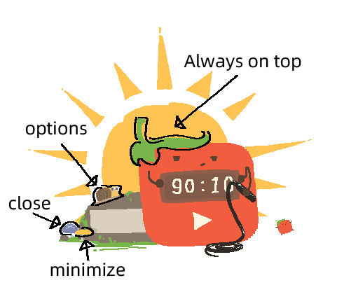
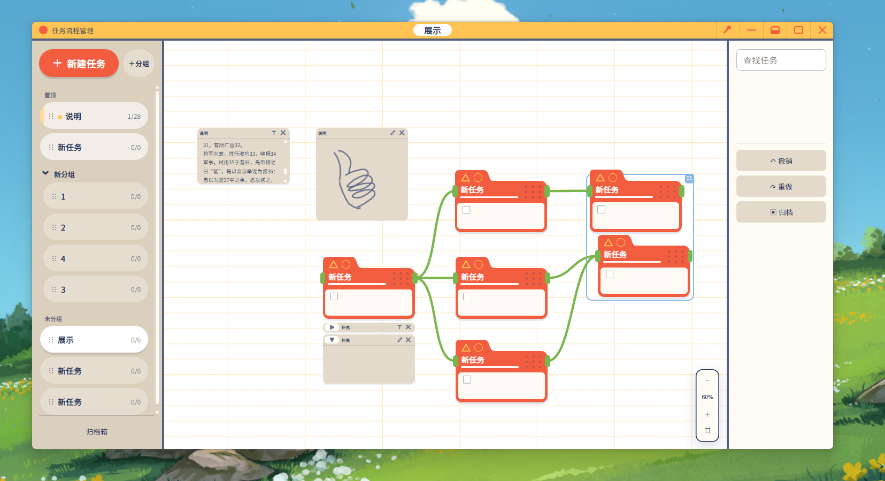
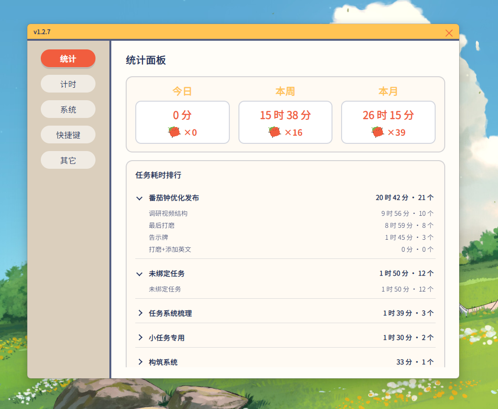

[中文](README.md) · [English](README-GPT.en.md)

[](LICENSE)
[](https://github.com/nychin/workmato/releases)
[](#)


# 工作番茄/Workmato

## 概述

- 工作番茄是一个桌面宠物风格的效率工具，主面板是像素卡通风格的番茄钟，此外还有一个任务流程管理器界面。
- **语言**：支持中文、英文、日语
- **系统要求**：Windows 10 / 11（64 位）。软件基于 Electron，理论上可跨平台。

## 功能特性

**像素UI**
- 精心绘制的像素卡通风格UI，包含闲置、专注、延时、休息等多个常规状态以及庆祝、鞭策等彩蛋状态，计时状态时还有呼吸动态效果

**正计时延时模式**
- 使用传统番茄钟时是否常常因为在手感火热时专注时间结束而感到苦恼？延时模式为你带来弹性的专注时间。
- 在专注时间结束后会自动进入正计时的延时模式，延时时间也计入专注时间。
- 手动结束延时模式后进入休息，自由的安排自己的专注时间，避免被结束提醒打断。

**自动计算休息时间**
- 可以选择自动计算休息时长，在设置中调整计算的比例等参数

**无按钮设计**
- 伪装成场景元素的功能按钮，UI界面更加生动协调

**告示牌**
- 实时显示任务画布中挂起的任务，帮你保持专注
- 点击告示牌即可打开任务流程管理器

**任务流程画布**
- 适用轻量个人流程规划需求的任务管理器
- 多种符合直觉的卡片添加方式快速调整任务流程
- 无限节点画布，流畅的文本编辑体验，支持多种节点满足子任务规划和备注需求

**统计**
- 番茄钟和任务管理器一同使用时可以对每个任务的每个环节所耗费的时间进行统计，跟踪自己的工作状态

**庆祝动画**
- 当任务完成时小番茄会一起庆祝（处于专注状态时）


## 其它界面预览

### 番茄钟




### 任务流程管理器



### 统计



## 安装

### 下载

从 [Releases](https://github.com/nychin/workmato/releases) 下载 `workmato-setup-1.3.2.exe`（NSIS 安装包，可自定义安装目录），适用 Windows 10 / 11（64 位）。

### 说明

安装完成后在任务管理器中查看使用说明

## 从源码运行（Quick Start）

需要 Node.js 18+ 与 npm：

```bash
npm install          # 安装依赖
npm run dev          # 开发模式：vite 热更新 + 自动启动（含任务流程画布源码）
npm run build        # 构建（主进程 + 渲染进程产物到 dist/）
npm run test:taskflow  # 任务数据存储迁移测试
npm run pack         # 打包 NSIS 安装包（release/workmato-setup-<版本>.exe）
npm run pack:dir     # 打包免安装目录版（release/win-unpacked）
```

开发模式使用独立的数据目录（`%TEMP%\tomato-clock-dev`），与正式安装版数据互相隔离，调试不会污染真实任务数据。

## 技术架构（简要）

**桌面壳**：Electron + TypeScript（严格模式），采用主进程 / 渲染进程 / preload 三层结构，通过 `contextBridge` 暴露最小化 API，渲染进程不直接访问系统能力。

**番茄钟窗口**：PixiJS 6（WebGL）按素材位图渲染 491×407 像素画布；透明无边框窗口，点击穿透基于静态命中图（hitmap）——只有按钮区域响应点击，其余区域用于拖动窗口。

**计时核心**：主进程内的表驱动状态机（TimerFSM）+ 每秒计时引擎，驱动「闲置 → 专注 → 延时 → 休息」等状态流转；任务完成等事件通过 IPC 触发番茄钟庆祝动画。

**动画系统**：自研声明式 Timeline 引擎（JSON 参数驱动缓动、时长、缩放），呼吸、状态过渡、庆祝、鞭策等动画都由它驱动；隐藏的动画调试面板（连点番茄蒂 5 次）可实时调整参数。

**任务流程画布**：原生 TypeScript 实现的自由画布（不依赖前端框架），支持无限画布、流程连线、说明卡/涂鸦、分组、撤销重做、按任务搜索定位。

**数据存储**：sql.js（WASM 版 SQLite），由主进程统一读写并以原子方式落盘；渲染进程通过 IPC（preload API）访问，保证数据一致与迁移安全。

**多语言**：内置中 / 英 / 日三语，文案集中在 `src/shared/i18n`，任务示例数据亦按语言分别提供。

**窗口组成**：番茄钟主面板、任务流程管理器、设置窗口、动画调试面板，各窗口独立运行、按需开合。

## 许可证

本项目采用 [PolyForm Noncommercial 1.0.0](LICENSE)。

- 允许：个人学习、使用、修改、再分发
- 禁止：任何商业用途（包括销售、收费托管、广告盈利等）
- 分发时需保留版权声明与许可证全文

**素材版权说明**：内置的像素素材、音效与字体文件版权归原作者所有，仅随本项目以非商业目的分发，请勿单独提取用于商业用途。
